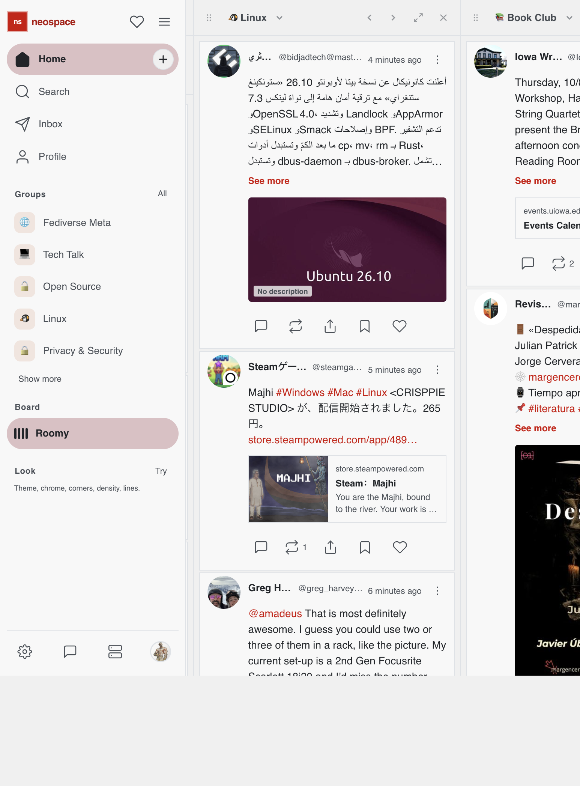
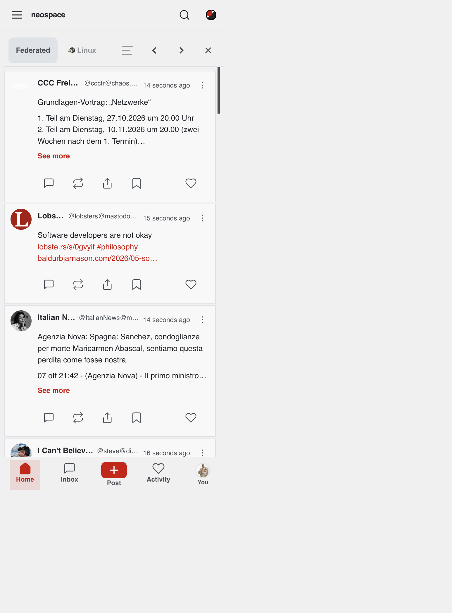
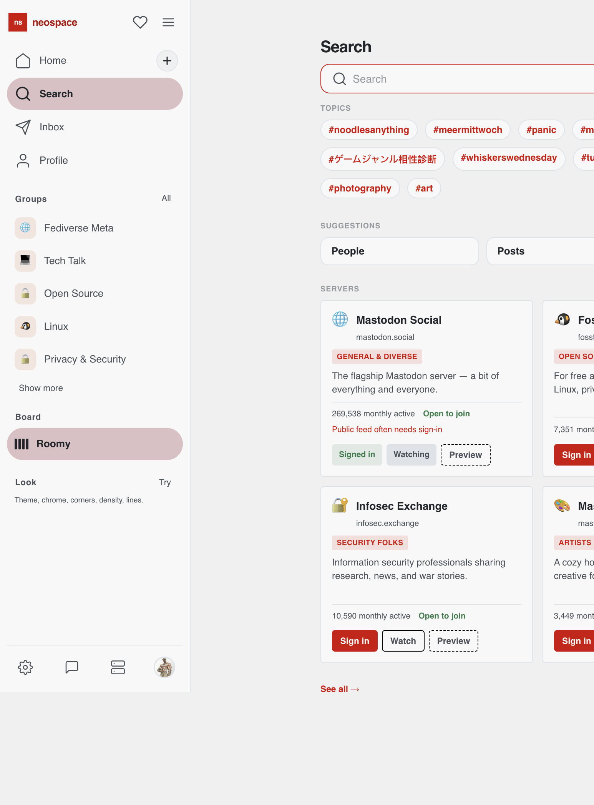
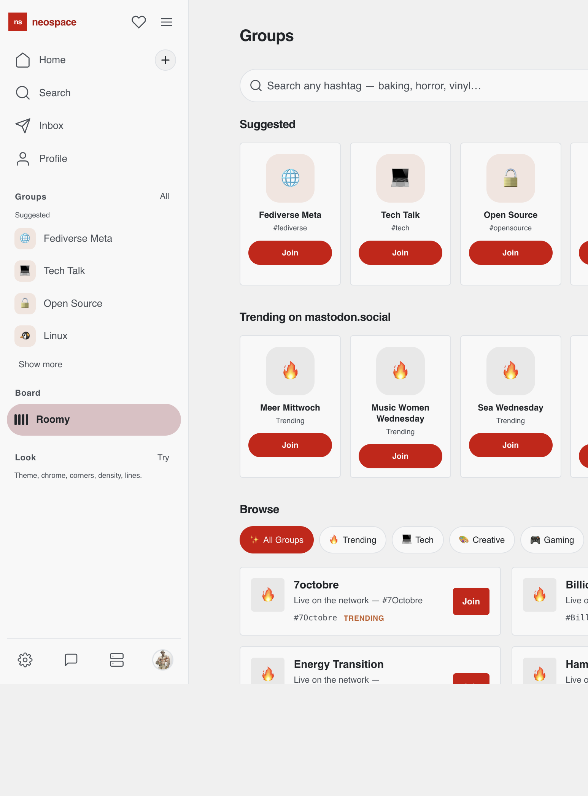
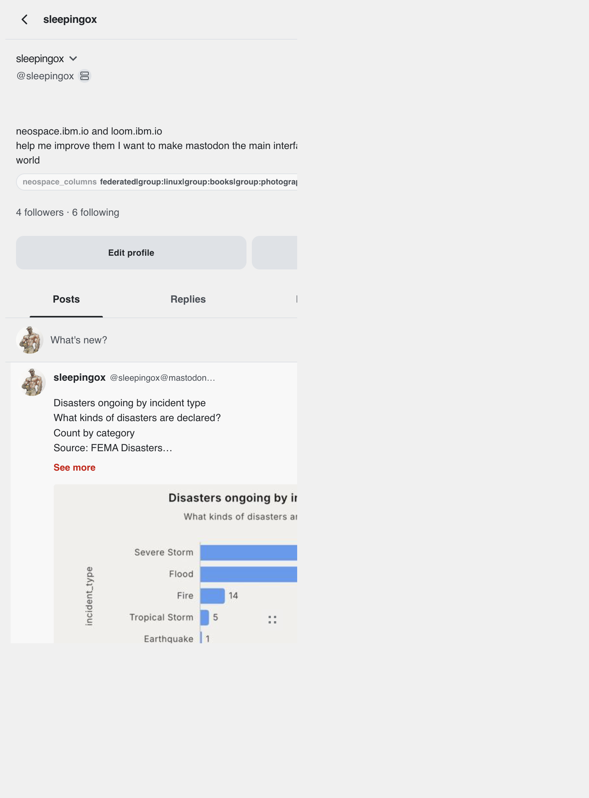

# NeoSpace

Multi-column Fediverse client for Mastodon, GoToSocial, and other ActivityPub-compatible servers. TweetDeck-style boards, multi-account OAuth, deep theming, and ibm.io suite integration — all in the browser as a static SPA.


*Home board — up to eight timeline columns, each with its own feed type and scroll position.*

**Live:** [neospace.ibm.io](https://neospace.ibm.io) · [neospace-dc4.pages.dev](https://neospace-dc4.pages.dev)

---

## What NeoSpace is

NeoSpace is a frontend-only Fediverse client. It talks directly to your instance's REST API via [masto.js](https://github.com/neet/masto.js) — no NeoSpace backend for timelines or auth. You pick a server, approve OAuth, and get a multi-column board for home, local, federated, groups, search, notifications, and DMs.

It is part of the [ibm.io](https://ibm.io/) tool suite (alongside [Loom](https://loom.ibm.io/) and [wordcount](https://ibm.io/wordcount/)), sharing Braun-inspired design tokens and cross-app compose handoff.

### Goals & principles

- **Multi-column by default** — TweetDeck-style boards on desktop; swipeable carousel on mobile.
- **Multi-account, multi-server** — Connect several instances; switch active account without losing column layouts (stored per-account, device-local).
- **Honest Fediverse client** — Works with Mastodon and GoToSocial today; no invented APIs.
- **Deep theming & accessibility** — 10 color themes, 8 UI chrome styles, dyslexic-friendly fonts, contrast modes, focus traps, shared a11y primitives (`NeoTabs`, `NeoMenu`, `NeoRadioGroup`).
- **ibm.io suite integration** — Loom chart handoff into compose; suite waffle menu; shared visual language from wordcount/Braun system.
- **Static-first deploy** — Nuxt SPA on Cloudflare Pages (or Docker/nginx); tokens stay in the browser.

### Current status (Oct 2026)

A holistic UX / design / a11y / security audit ([744 items](docs/AUDIT-2026-10.md)) is **largely complete: ~733/744 addressed**. Critical bugs (CW handling, OAuth token revoke, DM safety, sanitizer holes, contrast, focus traps, CI) were fixed in the Oct 2026 pass.

**11 items remain** as larger epics — tracked in [docs/PLAN-DEFERRED-AUDIT.md](docs/PLAN-DEFERRED-AUDIT.md):

| Priority | Epic |
|----------|------|
| 1 | Settings mobile drill-down nav |
| 2 | Compose upload progress + cancel |
| 3–4 | Compose `#`/`:emoji:` autocomplete; polls (scheduling done) |
| 5 | Split `SettingsModal` into panels |
| 6 | Split `instances` store |
| 7 | Self-host Google Fonts |
| 8 | Trusted Types + token isolation + CSP harden |
| 9 | Settings fork-specific paths (GoToSocial/Akkoma) |
| 10 | Playwright + axe CI |
| Ops | Turnstile keys (plumbed, needs env) |

See [docs/STATUS.md](docs/STATUS.md) for the full picture.

---

## Screenshots

| | |
|---|---|
|  | **Home board** — multi-column timelines with add-column menu |
|  | **Mobile home** — carousel with settings, feeds, search, inbox |
|  | **Explore** — search, topics, and server directory |
|  | **Groups** — hashtag groups discovery and membership |
|  | **Profile** — account view, edit, and posting history |

---

## Features (what ships today)

### Board & feeds
- **1–8 columns** per account — home, local, federated, group (hashtag), profile peek, search, notifications, messages
- **Desktop densities** — packed strip, roomy strip, focused tabs
- **Mobile modes** — flow list or full-bleed flip carousel
- **Column drag-and-drop** reorder; config persisted in localStorage per account
- **Live polling** for timelines, notifications badge, DM inbox

### Accounts & auth
- **OAuth 2.0 PKCE** login against any Mastodon-compatible instance
- **Multi-account** on different servers; multiple accounts on the same server (separate slots)
- **Public timeline preview** without login (curated default instance)
- **Token revoke on logout**; session-expired handling

### Social actions
- Compose posts with **@mention autocomplete**, CW/spoiler, visibility picker, media attachments, alt text
- Reply, boost, favourite, bookmark, share, mute, block, report
- **Thread view** with focused reply target
- **Direct messages** — inbox, conversation threads, compose with recipient picker
- **Notifications** page with filtering and mark-read

### Groups
- Hashtag groups as a first-class UI (follow/unfollow tag, trending, categories, group columns)

### Profile & settings
- Profile view (self and others), followers/following modals
- **Profile insights** — engagement heatmap, post mix, CSV export, Loom export
- **Settings modal** synced with Mastodon API — profile, privacy, notifications, appearance, posting defaults, filters, import/export
- **Chaos Mode** — custom CSS via profile metadata field (`css`, `custom_css`, `theme`, or `style`)

### Appearance
- 10 themes (light, dark, contrast, paper, glass, frost, brutal, loom, tank, NES)
- 8 UI chrome styles (Braun, Monocle, Bauhaus, Noyes, IKEA, Military, Terminal, NYT)
- Font family, size, corner radius, density, line style controls
- PWA installable (auto-updating service worker)

### Suite & feedback
- **Loom handoff** — chart image + caption into compose from loom.ibm.io
- **Leave-a-note** FAB → GitHub issue via Pages Function (`POST /api/feedback`)
- **Suite menu** — quick links to ibm.io tools

### Security & quality
- DOMPurify HTML sanitization; profile CSS sanitizer; CSP headers
- Rate-limited feedback API with optional Cloudflare Turnstile
- Vitest smoke tests + GitHub Actions CI (`typecheck`, `test`, `generate`)

### Not yet (deferred)
- Hashtag / emoji autocomplete in compose
- Upload progress bars and cancel UI
- Scheduled posts in compose (polls still open)
- Self-hosted fonts (Google Fonts still loaded at runtime)
- Fork-specific settings deep links
- Playwright e2e / axe CI gate

---

## Quick start

**Requirements:** Node.js 22+ (see `.nvmrc`)

```bash
git clone https://github.com/mhsenkow/neospace.git
cd neospace
npm install
npm run dev
```

Open [http://localhost:3000](http://localhost:3000).

### Scripts

| Script | Purpose |
|--------|---------|
| `npm run dev` | Nuxt dev server |
| `npm run build` | Production build |
| `npm run generate` | Static SPA export (`.output/public`) — runs prepaint + spa-fallback |
| `npm run prepaint` | Regenerate `public/boot/prepaint.js` from appearance catalog |
| `npm run preview` | Preview production build |
| `npm run check` | Typecheck Pages Functions + Vitest |
| `npm run typecheck` | Typecheck `functions/` |
| `npm run typecheck:app` | Nuxt app typecheck (has known masto typing gaps) |
| `npm test` | Vitest smoke tests |
| `npm run cf:preview` | Generate + Wrangler Pages dev |
| `npm run cf:deploy` | Generate + deploy to Cloudflare Pages |
| `npm run analyze` | Bundle analysis |

---

## Deploy

### Cloudflare Pages (primary)

```bash
npx wrangler login   # one-time
npm run cf:deploy
```

**Dashboard settings** (if connecting Git for push-to-deploy):
- Build command: `npm run generate`
- Output directory: `.output/public`
- Node version: `22`

SPA deep links use `404.html` fallback (`scripts/spa-fallback.mjs`). Security and cache headers live in `public/_headers`.

### Leave-a-note (GitHub issues)

The floating note button posts to `POST /api/feedback` (`functions/api/feedback.ts`), which opens an issue on [mhsenkow/neospace](https://github.com/mhsenkow/neospace).

```bash
# Required — fine-grained PAT with Issues: Read and write on this repo
npx wrangler pages secret put GITHUB_TOKEN --project-name neospace
```

Optional label:

```bash
gh label create feedback --repo mhsenkow/neospace --color 0E8A16 --description "Leave-a-note from neospace.ibm.io" || true
```

### Turnstile (recommended)

Bot protection is plumbed but **needs keys to enforce**:

1. Create a widget at [Cloudflare Turnstile](https://dash.cloudflare.com/) → Turnstile.
2. **Site key** at build time: `NUXT_PUBLIC_TURNSTILE_SITE_KEY=…`
3. **Secret key** on Pages: `npx wrangler pages secret put TURNSTILE_SECRET_KEY --project-name neospace`

When `TURNSTILE_SECRET_KEY` is set, the API rejects requests without a valid token.

### Docker

Static image behind nginx — **no `/api/feedback`** (use Cloudflare Pages for the live API):

```bash
docker build -t neospace .
docker run -p 8080:8080 neospace
```

---

## Tech stack

| Layer | Choice |
|-------|--------|
| Framework | Nuxt 4 (`ssr: false` — client-only SPA) |
| UI | Vue 3 SFC + SCSS + CSS custom properties |
| State | Pinia |
| API client | [masto](https://www.npmjs.com/package/masto) v7 |
| Auth | OAuth 2.0 PKCE in browser; tokens in localStorage |
| Sanitization | DOMPurify |
| PWA | `@vite-pwa/nuxt` (autoUpdate service worker) |
| Hosting | Cloudflare Pages + Pages Functions |
| Tests | Vitest |
| CI | GitHub Actions (`.github/workflows/ci.yml`) |

---

## Project structure

```
app/
├── app.vue                 # Root shell — route announcer, focus main on nav
├── assets/css/             # main.scss, _variables.scss, _themes.scss, _structural.scss
├── components/
│   ├── shell/              # DesktopSidebar, MobileHeader, MobileTabBar, MobileDrawer
│   ├── Neo*.vue            # Shared a11y primitives (Tabs, Menu, Confirm, Sheet, …)
│   ├── RealComposeBox.vue  # Main compose UI
│   ├── TimelineColumn.vue  # Single feed column
│   └── …
├── composables/            # useMasto, useFocusTrap, usePager, useLoomHandoff, …
├── layouts/default.vue     # App chrome orchestrator
├── pages/                  # index, explore, groups, profile, messages, notifications, login, …
├── stores/                 # Pinia — see docs/ARCHITECTURE.md
└── utils/                  # appearance, oauthPkce, sanitizeHtml, instances, …
functions/
└── api/feedback.ts         # Pages Function → GitHub issues
public/
├── _headers                # CSP, HSTS, cache rules
├── boot/prepaint.js        # Generated — theme flash prevention
├── boot/rescue.js          # PWA chunk-load recovery
└── icons/                  # PWA manifest icons
scripts/
├── build-prepaint.mjs      # Generates prepaint.js from appearance.ts
└── spa-fallback.mjs        # Syncs 404.html for CF Pages SPA routing
shared/feedbackConstants.ts # Feedback API limits shared with client
docs/                       # Architecture, status, audit — see docs/README.md
```

---

## Documentation

| Doc | Contents |
|-----|----------|
| [docs/README.md](docs/README.md) | Docs index |
| [docs/ARCHITECTURE.md](docs/ARCHITECTURE.md) | System design, stores, data flows |
| [docs/STATUS.md](docs/STATUS.md) | Current state, deferred roadmap, ops checklist |
| [docs/CONTRIBUTING.md](docs/CONTRIBUTING.md) | Dev setup, conventions, PR expectations |
| [docs/PLAN-DEFERRED-AUDIT.md](docs/PLAN-DEFERRED-AUDIT.md) | Remaining large epics |
| [docs/AUDIT-2026-10.md](docs/AUDIT-2026-10.md) | Full Oct 2026 audit (744 items) |

---

## Custom CSS (Chaos Mode)

Add a profile field on your instance:

- **Name:** `css` (or `custom_css`, `theme`, `style`)
- **Value:** Your CSS using `--neo-*` variables

```css
:root {
  --neo-bg-primary: #0a0a0a;
  --neo-text-primary: #00ff41;
  --neo-accent: #ff00ff;
  --neo-font-family: 'Courier New', monospace;
}
```

---

## License

MIT
